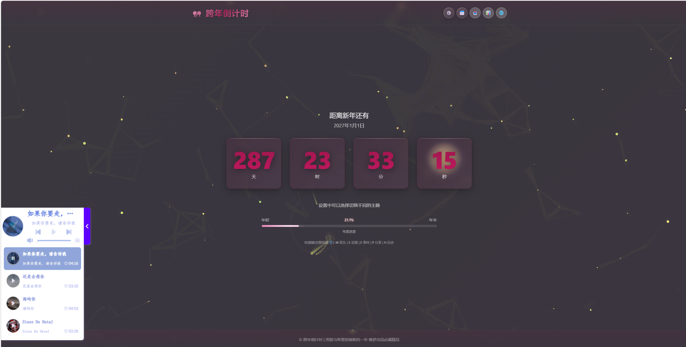

# 🎊 跨年倒计时网站

一个功能丰富、视觉精美的倒计时网站，支持自定义事件、多主题切换、多语言支持、音乐播放等功能。



## ✨ 功能特性

### 🕐 核心倒计时
- **精确倒计时** - 实时显示天、时、分、秒
- **自动更新** - 每秒自动刷新倒计时
- **年度进度** - 显示当前年份进度百分比
- **自定义事件** - 支持创建任意事件的倒计时

### 🎨 主题系统
- **精选主题** - 庆典、霓虹、奢华、星空、柔和
- **经典主题** - 红色、蓝色、紫色、金色、绿色、黑色
- **字体调节** - 支持调整字体大小 (80%-120%)
- **主题预览** - 实时预览主题效果
- **持久化存储** - 自动保存用户偏好设置

### 🌍 多语言支持
- 🇨🇳 简体中文
- 🇺🇸 English
- 🇯🇵 日本語
- 🇰🇷 한국어

### 📅 事件管理
- **事件创建** - 添加自定义倒计时事件
- **分类管理** - 工作、个人、学习、健康、社交、生日、其他
- **优先级设置** - 高、中、低三级优先级
- **标签系统** - 支持添加多个标签
- **提醒功能** - 事件提醒通知
- **状态管理** - 进行中、已完成、已归档
- **搜索筛选** - 按名称、类别、优先级、状态筛选

### 📊 历史统计
- **完成统计** - 已完成/已归档/已删除事件数量
- **年度统计** - 今年完成数、创建数、完成率
- **分类统计** - 各类别事件分布
- **连续天数** - 连续完成事件天数
- **时间线** - 历史事件时间线展示

### 📤 分享功能
- **链接分享** - 一键复制分享链接

### 🎵 音乐播放
- **背景音乐** - xf-MusicPlayer 音乐播放器
- **自动播放提示** - 解决浏览器自动播放限制

### 🎆 视觉效果
- **粒子动画** - Canvas 实现的动态粒子背景
- **烟花特效** - 倒计时结束时的庆祝烟花
- **玻璃拟态** - 现代化毛玻璃 UI 设计
- **平滑动画** - 数字切换脉冲动画
- **悬停效果** - 卡片悬停缩放效果

### ⌨️ 快捷键支持
| 快捷键 | 功能 |
|--------|------|
| M | 音乐控制 |
| S | 打开设置 |
| E | 事件管理 |
| P | 分享面板 |
| H | 历史统计 |

## 🛠️ 技术栈

- **HTML5** - 语义化标签
- **Tailwind CSS v3** - 响应式布局
- **CSS3** - 自定义动画和过渡
- **JavaScript (ES6+)** - 核心逻辑
- **Canvas API** - 粒子系统和烟花
- **LocalStorage** - 数据持久化

## 📁 文件结构

```
countdown/
├── index.html          # 主页面
├── style.css           # 样式文件
├── script.js           # 核心逻辑
├── i18n.js             # 国际化配置
├── README.md           # 说明文档
├── _headers            # Cloudflare Headers 配置
├── wrangler.toml       # Cloudflare Workers 配置
└── wrangler.jsonc      # Cloudflare Workers 配置
```

## 🎨 主题预览

| 主题 | 描述 |
|------|------|
| 🎉 庆典 | 节日庆典风格，活力四射 |
| 🌃 霓虹 | 深夜霓虹风格，OLED优化 |
| 💎 奢华 | 奢华金夜风格，高端大气 |
| 🚀 星空 | 星空科技风格，宇宙背景 |
| 🌸 柔和 | 温馨柔和风格，家庭友好 |

## 📱 响应式设计

- ✅ 桌面端 (1920px+)
- ✅ 笔记本 (1366px)
- ✅ 平板 (768px)
- ✅ 手机 (375px)

## 🔧 自定义配置

### 修改音乐播放器

在 `index.html` 中修改歌单 ID：

```html
<div id="xf-MusicPlayer" 
     data-cdnName="https://player.xfyun.club/js" 
     data-songList="你的歌单ID" 
     data-fadeOutAutoplay>
</div>
```

### 添加新主题

在 `style.css` 中添加：

```css
.theme-custom {
    --primary-color: #your-color;
    --secondary-color: #your-color;
    --bg-gradient-start: #your-color;
    --bg-gradient-end: #your-color;
}
```

### 修改默认语言

在 `i18n.js` 中修改：

```javascript
this.currentLanguage = 'zh-CN'; // 默认语言
```

## 🌐 浏览器兼容性

| 浏览器 | 版本 |
|--------|------|
| Chrome | 90+ |
| Firefox | 88+ |
| Safari | 14+ |
| Edge | 90+ |
| Opera | 76+ |

## 📊 性能优化

- `requestAnimationFrame` 优化动画
- Canvas 粒子对象池复用
- CSS 动画使用 transform/opacity
- 离屏 Canvas 渲染优化
- 自适应质量调节

## 📝 更新日志

### v2.0.0
- ✨ 新增事件管理系统
- ✨ 新增历史统计功能
- ✨ 新增分享功能
- ✨ 新增多语言支持 (中/英/日/韩)
- ✨ 新增音乐播放器
- 🎨 优化主题系统
- 🎨 优化粒子动画效果
- 🐛 修复已知问题

## 📄 许可证

本项目可自由使用和修改。

## 👨‍💻 作者

**晚梦亦清歌** 

---

**祝您新年快乐！** 🎊✨
